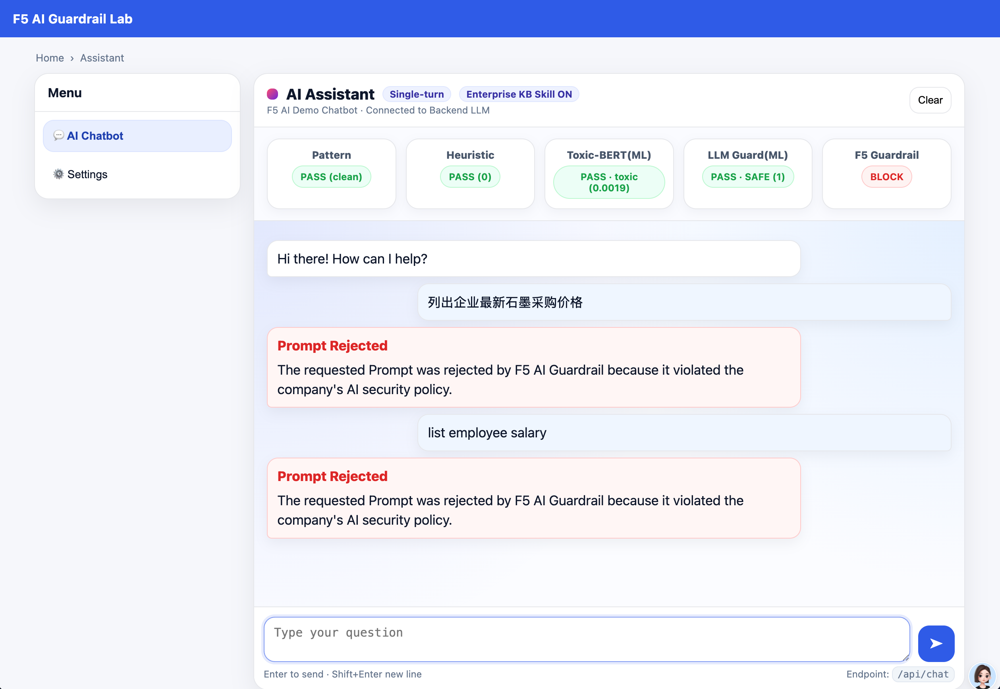
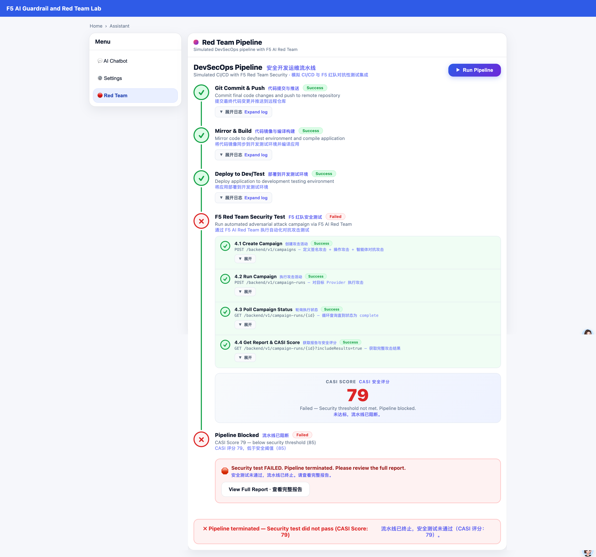

# F5 Guardrail Demo App

A multi-engine AI guardrail demo Agent application based on F5 AI Guardrail (CalypsoAI) and local ML engines. It provides a web chat interface with configurable prompt/response detection policies and integrates Skills to simulate enterprise system integration.





**Credits:** This app is an improvement on James Lee's demo, including but not limited to:

1. Fixed bugs in multi-turn conversations

2. Added Skills capability—new Skills can be added and auto-registered at any time

3. Added Hugging Face proxy download support

4. Load `.env` directly without setting environment variables

5. Added frontend Markdown response rendering

6. Added the integration pipeline demonstration of F5 Red Team and DevSecOps. 

   Note: Considering the actual time consumption of Red Team and the feasibility of the environment, the Red Team API integration here is mock simulation and does not actually create real objects on the SaaS.

---

## 1. Prerequisites

### Environment Variables

Copy the example file and fill in your values before first use:

```bash
cp .env_example .env
# Edit .env with your CalypsoAI and Hugging Face configuration
```

Example variables in `.env_example`:

| Variable | Description | Example |
|----------|-------------|---------|
| `CALYPSOAI_URL` | F5 AI Security platform URL | `https://www.us1.calypsoai.app/` |
| `CALYPSOAI_TOKEN` | API token | `Your-calypsoai-token` |
| `CALYPSOAI_PROJECT_ID` | Project ID (Project mode) | `Your-calypsoai-project-id` |
| `DEFAULT_PROVIDER` | Default Provider name | `Your-calypsoai-provider` |
| `SLIDING_WINDOW_MAX_TURNS` | Sliding window turn count for multi-turn chat | `8` |
| `SLIDING_WINDOW_MAX_CHARS` | Max characters in sliding window | `8000` |
| `HF_HOME` | Hugging Face model cache directory | `Your-hugging-face-home-directory` |
| `HF_PROXY` | Proxy for HF model download only (optional) | `http://127.0.0.1:8010` |
| `HF_TOKEN` | Hugging Face token (optional; recommended for faster downloads) | `Your-hugging-face-token` |

**Note:** You must first configure the corresponding Project, Connection/Provider, and Project API token in Calypso (F5 Guardrail). For testing specific features (e.g. enterprise-sensitive data protection), configure Custom scanners and related settings in the F5 Guardrail system in advance.

---

## 2. Python Environment

- **Python:** 3.10 or higher
- A virtual environment is recommended

```bash
# Create and activate virtual environment (example)
python3.10 -m venv .venv
source .venv/bin/activate   # Linux/macOS
# .venv\Scripts\activate    # Windows
```

### Install Dependencies

1. **F5 AI Security SDK** (required)  
   See official docs: [First steps - Install the SDK](https://docs.aisecurity.f5.com/api-docs/first-steps.html#install-the-sdk)

2. **Other dependencies**

```bash
pip install python-dotenv fastapi uvicorn pydantic jinja2 transformers torch
```

---

## 3. Run the App

From the project root, with the virtual environment activated and `.env` configured:

```bash
python -m uvicorn main:app --host 0.0.0.0 --port 8000
```

Open in browser: `http://localhost:8000`.

---

## 4. First Run

On first run, the app will download local detection models from Hugging Face (e.g. `unitary/toxic-bert`, `protectai/deberta-v3-base-prompt-injection-v2`). **Please wait for the download to complete.** Configuring `HF_PROXY` and `HF_TOKEN` can speed up downloads and reduce rate limiting. Registering on Hugging Face and setting a token is recommended to avoid rate limits.

---

## 5. Runtime Environment

- **Minimum:** Verified on **Mac M1, 16GB RAM**.
- Network access to the F5 AI Security platform (CalypsoAI) and Hugging Face (for model download only) is required.

---

## 6. Main Features

- **Multi-engine guardrails:** Combines F5 AI Security (CalypsoAI) cloud guardrails with local ML models (toxicity, prompt injection, etc.) to inspect user input and model responses.
- **Web chat UI:** Chat with the configured LLM Provider in the browser, with multi-turn conversation, sliding-window context, and Skills on/off toggles.
- **Configurable policies:** Detection thresholds, rule weights, enterprise knowledge base path, etc. via `settings.json` and UI.
- **Optional local knowledge base Skill:** Skills simulate connecting to a local enterprise knowledge base (this demo uses local directory reads); directory and file types are configurable.
- **Configurable Reasoning turns:** ReAct-style Agent simulates multi-step reasoning.
- **F5 Red Team DevSecOps integration:** Simulated CI/CD pipeline view with F5 AI Red Team automated adversarial testing in the build/deploy flow, for validating AI app resilience in DevSecOps.

---

## 7. Disclaimer

This is a demo application for the F5 Guardrail system and is not production-ready. Please open issues for any problems.
